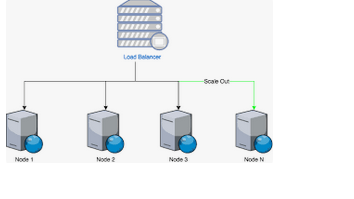

# Why You Need Platforms

In today's fast-paced development environment, individual tools and processes can become cumbersome and hinder your ability to deliver innovative solutions efficiently. Developer platforms address these challenges by providing a centralized hub that streamlines your workflow and empowers you to build better products faster.

Here's a deeper dive into why developer platforms are essential:

## Reduced Redundancy and Reinvention:
Eliminate the need to "build the wheel" from scratch. Platforms offer pre-built components, APIs, and templates that handle common functionalities, freeing you to focus on unique features and complex problems.

## Standardized Practices and Improved Consistency:
Platforms enforce best practices for coding, security, and deployment, ensuring consistent code quality and reducing errors across projects.

## Simplified Collaboration and Knowledge Sharing:
Break down silos and foster collaboration. Platforms provide a central location for code, documentation, and communication, enabling knowledge sharing and team cohesion.

<!-- -### Diagram:
 -->

## Enhanced Scalability and Maintainability: 
Platforms are built to handle growing application complexity and user bases. Standardized infrastructure and tools make scaling development resources and maintaining codebases significantly easier.

## Automated Workflows and Increased Efficiency:
Streamlined workflows with automation tools free you from repetitive tasks like testing, deployment, and configuration management, allowing you to focus on higher-level development activities.

## Improved Developer Experience:
Platforms are designed to enhance your development experience. They offer intuitive interfaces, centralized access to tools, and readily available documentation, making your job faster, easier, and more enjoyable.

In essence, developer platforms are like well-stocked toolboxes for developers.  They provide the tools and resources necessary to build high-quality applications efficiently. By leveraging these platforms, developers can:

- **Focus on innovation:**  Spend less time on repetitive tasks and more time on crafting unique features and functionalities.
- **Deliver faster:** Streamlined workflows and automation lead to quicker development cycles and faster time-to-market.
- **Reduce errors:** Standardized practices and automated testing minimize bugs and ensure code quality.
- **Work collaboratively:** Foster knowledge sharing and team cohesion through centralized communication and code repositories.
- **Build for the future:** Platforms are built with scalability in mind, allowing applications to adapt to future growth with ease.

By understanding these benefits and the real-world examples of how platforms address common developer challenges, you can appreciate the power and value a developer platform brings to the table.  The next section will delve into the specific features and functionalities offered by our platform, empowering you to unlock your full potential as a developer.
